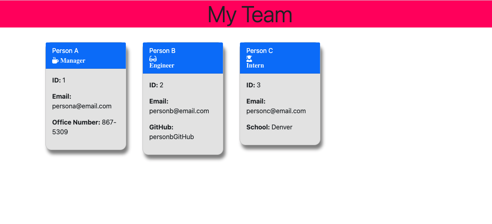
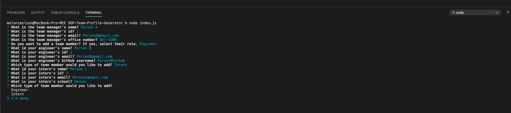

# OOP-Team-Profile-Generator

## Table of Contents
1. [Title](#title)
2. [Description](#Description)
3. [Installation](#Installation)
4. [Collaboration](#Collaboration)
5. [Steps](#Steps)
6. [Tests](#Tests)

Team Profile Generator

## General Info
The purpose of this task is to create a to generate a webpage that displays my team's basic info
SO THAT I have quick access to their emails and GitHub profiles
## Technologies 
The site uses HTML, CSS code, Javascript,node,js, Inquirer, Jest

## Installation
To access the website go to: https://github.com/MelElson/OOP-Team-Profile-Generator

# Collaboration 
Pulls are encouraged. Any changes document. 

# Steps
Steps taken by user
GIVEN a command-line application that accepts user input
WHEN I am prompted for my team members and their information
THEN an HTML file is generated that displays a nicely formatted team roster based on user input
WHEN I click on an email address in the HTML
THEN my default email program opens and populates the TO field of the email with the address
WHEN I click on the GitHub username
THEN that GitHub profile opens in a new tab
WHEN I start the application
THEN I am prompted to enter the team manager’s name, employee ID, email address, and office number
WHEN I enter the team manager’s name, employee ID, email address, and office number
THEN I am presented with a menu with the option to add an engineer or an intern or to finish building my team
WHEN I select the engineer option
THEN I am prompted to enter the engineer’s name, ID, email, and GitHub username, and I am taken back to the menu
WHEN I select the intern option
THEN I am prompted to enter the intern’s name, ID, email, and school, and I am taken back to the menu
WHEN I decide to finish building my team
THEN I exit the application, and the HTML is generated

# Tests
To run tests: npm run test
	
    

### Team Generator Screenshot

### Team Generator Input

### Walkthrough

